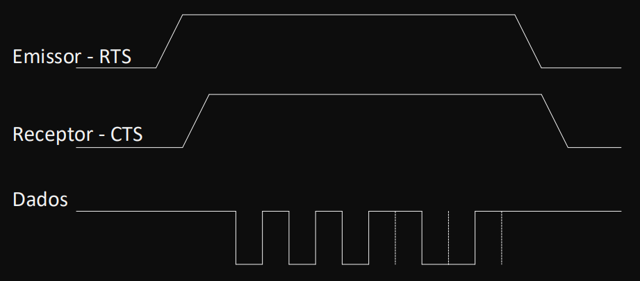

# Arduino Transmission Data Protocol

**Disciplina: SCC0142 - Redes de Computadores**

 - [Gustavo Henrique Brunelli - 11801053](https://github.com/GBrunelli)
 - [Matheus Ventura de Sousa - 11345541](https://github.com/matheus-sousa007/)
 - [Pedro Lucas de Moliner de Castro - 11795784](https://github.com/pedrolmcastro)

> Este projeto está disponível no GitHub por meio [deste link](https://github.com/matheus-sousa007/Arduino-RS-232C/).

O projeto baseia-se em fazer dois arduinos se comunicarem usando um protocolo em comum. O protocolo feito pelo grupo é customizado e tem como base o **RS-232C**, modficicada para transmitir de forma serial e síncrona.

Para a transmissão do caractere, foi utilizado um bit de paridade para detectar possíveis erros de transmissão. O grupo adotou a paridade ímpar; assim, o bit de paridade estará ativo caso a soma de todos os bits ativos do caractere somarem um número par. Caso contrário, o bit de paridade permanecerá desativado.

## Ferramentas utilizadas no projeto

Para o desenvolvimento do projeto, foi utilizada a linguagem **C++ 11** dentro das ferramentas de desenvolvimento **Arduino IDE** e **Tinkercad Circuits** para a plataforma Arduino UNO R3.

## Compilação e execução

Caso possua 2 arduinos 3 jumpers para conectar as portas I/O digitais 11, 12 e 13 de cada arduino e dois cabos de alimentação USB, basta baixar o repositório com o comando abaixo e abrir os arquivos `Emissor/emissor.ino` e `Receptor/receptor.ino` dentro da IDE do Arduino.

```
git clone https://github.com/matheus-sousa007/Arduino-RS-232C.git
```

Após a abertura dos arquivos, configure as respectivas portas dos arduinos e carregue o sketch em `Sketch -> Carregar` em cada programa aberto. Caso não possua os dois arduinos, poderá utilizar [este Tinkercad](https://www.tinkercad.com/things/2a1NkF46jcS?sharecode=aAZjLkvQorBfngIxJZ01mImUlqpqjhRwDdd5XMdHzJM) e executar o projeto clicando em `Iniciar Simulação`.

### Comunicação entre os arduinos

Antes de iniciar a transmissão de dados, o emissor precisa ativar a RTS flag para sinalizar ao receptor que há dados a serem transmitidos.
Ao verificar que o RTS do emissor está ativo, o receptor ativará o CTS o mais rápido possível para sinalizar ao emissor que está pronto para receber os dados.

Quando os dois sinais são ativados, o timer começa a contar visto que a transmissão de dados se iniciará por meio do canal de dados. Ao terminar a transmissão, o emissor desativa a flag RTS para sinalizar que não há mais dados a serem enviados no momento. Assim, o receptor desativa o CTS para avisar que não está mais preparado para receber dados.



A comunicação entre os arduinos é feita seguindo o esquema abaixo.


### Sincronização do clock

Para a inicialização do clock do receptor foi utilizado um delay de 1 HALF_BAUD para manter o seu próprio sinal de clock entre os sinais do emissor garantindo assim a transmissão correta dos dados. Além disso, o grupo decidiu utilizar um clock a mais no receptor para garantir a recepção de todos os dados antes de baixar o sinal do RTS. Como a nossa unidade de dado do protocolo é um caractere, se a sincronia for perdida em algum momento, na próxima transmissão da UDP, a sincronia do clock pode ser recuperada.

### Formatação da Unidade de dados do protocolo.

Por convenção adotada pelo grupo visando a facilidade de implementação visto que só é necessário fazer um bitwise and com 0b1111111 (127 em decimal) no dado recebido para eliminar o bit de paridade da informação final, o formato da unidade de dados do protocolo a serem transmitidos começa pelo bit de paridade seguido pelo bit mais significativo do caractere e indo até o bit menos significativo. 

## Conclusão

O grupo conseguiu executar o projeto sem grande dificuldade na implementação do protocolo proposto. Além disso, o grupo considera uma notável melhora entre o tempo de execução do Sketch no arduino físico e a o tempo de execução do Sketch no Tinkercad.

Ademais, o grupo considerou que o último caractere do input '\n' sempre será transmitido já que o receptor serve apenas como um terminal para apresentar as palavras enviadas pelo emissor. Isso pode ser visto no vídeo cujo link estará logo abaixo.


## Vídeo

O grupo possui um vídeo explicativo sobre o projeto o qual pode ser acessado por [este link](https://youtu.be/RlWI3TtgbQQ). 
